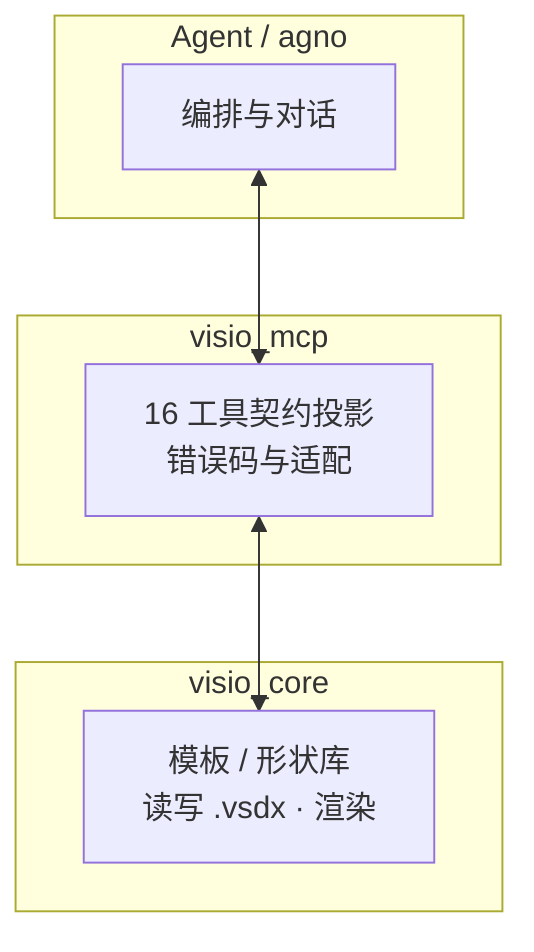

# Visio Agent 插图（Mermaid 源码）

在 Cursor / VS Code 中打开本文件，使用 **Markdown 预览**（默认快捷键 Ctrl+Shift+V）查看渲染；安装工作区推荐扩展 `Markdown Preview Mermaid Support` 后，代码块内的 Mermaid 会显示为图。

导出 PNG/SVG：在 `docs/mermaid` 执行 `npm install` 后运行 `npm run export:figures` 或 `npm run export:figures-svg`。`mmdc` 会从本文档中取出**所有** ` ```mermaid ` 代码块，生成 `dist/figures.md-1.svg`（或 `.png`）等文件，可直接插入 Word。

---

## 图 F1 — 系统总体架构（示例）



---

## 图 F2 — 端到端闭环（示例）


